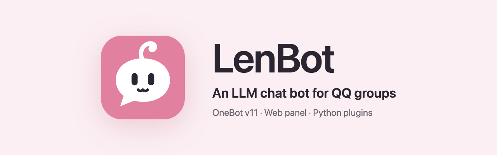

<p align="center"></p>

<p align="center"><a href="README.md">中文</a> · <a href="https://lendevs.github.io/LenBot/">Documentation (zh)</a> · <a href="https://lendevs.github.io/LenBot/guide/quick-start">Quick start (zh)</a></p>

LenBot is a QQ group chat bot driven by a large language model. It sends and receives QQ messages through OneBot v11, and replies are generated by a model. The model service and API key are not included.

The bot is not operated through commands. When someone in the group speaks, the model decides whether to reply. If it replies, it also decides which message to answer, or whether a single sticker is enough. When someone asks for a report or some research, the work is handed to a background task, the chat continues, and the result is posted to the group when the task finishes.


## Features

- **Group chat.** Each group has one continuing conversation. As it grows, older parts are condensed into a summary, shown in the panel as a recap. Replies can quote the original message, mention people, or be a single sticker. By default the bot speaks when it is mentioned or replied to; it can also be set to join discussions on its own.
- **Personas.** The character's profile and way of speaking live in a persona package, together with boundaries, example lines, reference notes and stickers. The default persona, Xiaoran (小然), works after installation. Changes can be tried in a test chat in the panel before they are saved.
- **Memory.** Memory is stored locally as Markdown files, separately for each group. It can be viewed and edited in the panel, and the bot can be told to forget something completely.
- **Background tasks.** Longer work such as reports and research runs as a background task in a Docker container. While it runs, people can ask about progress, add instructions or cancel it.
- **Tools.** The model can search and read web pages, look at images and transcribe voice messages. It can also read forwarded chat records and member lists, and MCP servers can be connected.
- **Plugins.** Plugins are written in Python. They can add commands and scheduled jobs, or give the model new tools. There are four official plugins: group summaries, a GSUID Core bridge, A-SOUL and Bilibili.
- **Group vocabulary.** LenBot records phrasing and stickers that are common in a group, including the group's slang. Recorded entries can be reviewed and edited in the panel, and unwanted ones can be turned off.
- **Web panel.** First-time setup and all later settings are done in the panel, as are viewing logs, upgrading and recovering from a failed upgrade. The owner can also ask the bot in a group chat to change settings.

## Requirements and limits

- QQ is the only supported platform.
- LenBot does not log in to QQ itself. A OneBot implementation such as [NapCat](https://github.com/NapNeko/NapCatQQ) has to run alongside it.
- No model is included. Supported APIs are OpenAI-compatible, OpenAI Responses, Anthropic and Gemini.
- Voice messages are understood, but replies are text only.
- Prompts and the panel are in Chinese only.

## Quick start

The first public version, 0.2.0, has not been released yet. Until the release packages and Docker images are published, run LenBot from source. You need:

- [uv](https://docs.astral.sh/uv/) and Node.js 22
- a OneBot implementation that is logged in to QQ
- the base URL and API key of a model service

```sh
git clone https://github.com/lendevs/LenBot.git
cd LenBot
./scripts/install.sh
uv run --no-sync len-bot
```

On first start the terminal prints a link:

```text
尚无根配置。请打开 http://127.0.0.1:52811/#token=...
```

Open it in a browser and complete the seven steps of the setup wizard: admin account, QQ connection, owner, chat model, optional vector model, persona and first group, and official plugins. After saving, LenBot starts with the new configuration and the page switches to the panel.

For the first run, choose simulated delivery in the wizard. Replies then appear only in the panel and are not sent to QQ. Try a few rounds on the panel's chat test page. Once the results look right, switch delivery to real QQ sending under Settings → Connection.

The full walkthrough is in the [quick start (zh)](https://lendevs.github.io/LenBot/guide/quick-start).

## Installation options

All three options run the same program. If unsure, use the release package.

| Option | Suited for |
|---|---|
| [Release package (zh)](https://lendevs.github.io/LenBot/guide/install-package) | Long-term use on a personal computer or a Linux server. Needs only uv, includes service scripts, upgrades from the panel, and can recover from a failed upgrade |
| [Docker (zh)](https://lendevs.github.io/LenBot/guide/install-docker) | Servers and NAS devices. Also the option for background tasks on Windows |
| [Source (zh)](https://lendevs.github.io/LenBot/guide/install-source) | Changing the code, or using the development version |

Once 0.2.0 is released, packages will be on [GitHub Releases](https://github.com/lendevs/LenBot/releases) and images at `ghcr.io/lendevs/lenbot`, with the same images on Docker Hub.

## Documentation

Most documentation is in Chinese. English versions exist for this README, [CONTRIBUTING](CONTRIBUTING.en.md), the [deployment overview](deploy/README.en.md), the [plugin guide](developer/plugins-v1.en.md) and the [plugin template](https://github.com/lendevs/lenbot-plugin-template).

| Topic | Where |
|---|---|
| Installation, first-time setup and daily use | [Documentation site (zh)](https://lendevs.github.io/LenBot/) |
| Deployment options and optional services | [Deployment](deploy/README.en.md) |
| Maintaining personas, plugins and background tasks | [Operations (zh)](deploy/current/operations.md) |
| Writing plugins | [Plugin guide](developer/plugins-v1.en.md), [plugin template](https://github.com/lendevs/lenbot-plugin-template) |
| Writing persona packages | [Personas (zh)](developer/personas.md), [Xiaoran's package](examples/personas/companion/) |
| Internal structure | [Architecture (zh)](developer/architecture.md) |
| Contributing | [CONTRIBUTING](CONTRIBUTING.en.md) |

Draft release notes are in [changelogs](changelogs/).

## License

Original code is licensed under [AGPL-3.0-only](LICENSE); see [NOTICE](NOTICE). Third-party dependencies and separate services keep their own licenses; see [THIRD_PARTY_NOTICES](THIRD_PARTY_NOTICES.md).
