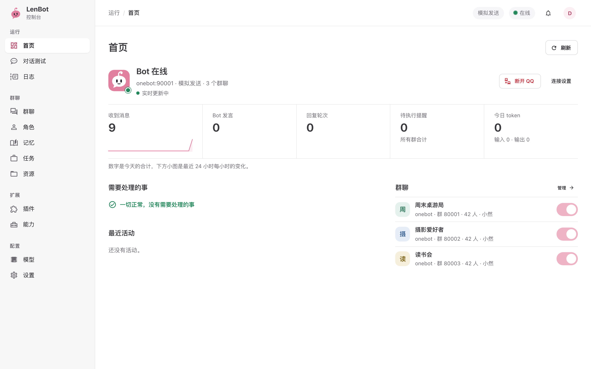

# LenBot

[中文](README.md)

LenBot is a chat agent that lives in your group chats. It connects to QQ through OneBot v11, is written in Python with asyncio and SQLite, and ships with a web control panel.

Installation and usage guides are on the **[documentation site (zh)](https://lendevs.github.io/LenBot/)**.



## How it is designed

LenBot is organized around the chat scene. Every group (or private chat) has one long-lived agent session:

- Messages from members, notifications from plugins and progress from background tasks all arrive as input to the same runtime and are handled by that session.
- The agent decides when to speak, what to say, whether to send a sticker, and whether to hand a long job to a background task.
- The host keeps track of what actually happened: how far a task has got, whether a reply was really sent, whether a file really arrived.

Event routing is still there. Exact commands and keyword rules are handled directly by plugins without going through the model. But the agent is what coordinates the group's conversation, rather than one feature that a command happens to call.

## Features

| Area | What you get |
|---|---|
| Chat | One persistent session per scene; the agent decides whether and to whom to reply; stickers, quotes and mentions; long conversations are compacted into a recap |
| Personas | Persona packages with identity, voice, boundaries, examples, knowledge and stickers; import, export and trial-chat before adopting changes |
| Memory | Local Markdown memory isolated per scene; full-text and optional vector search; background curation, editing, deletion and full forgetting |
| Background tasks | Long jobs run in an isolated Docker container with Pi; follow-up questions, cancellation and resumption; registered outputs can be sent to the chat |
| Tools | Web search and reading, image viewing, voice transcription, forwarded messages, member info, MCP and browser tasks |
| Plugins | In-process Python plugins with commands, rules, schedules, tools and skills; install from Git or ZIP with version checks and per-plugin reload |
| Learning | Learns phrasing, slang and stickers from the group and watches how people react to replies; everything can be adopted, edited or disabled in the panel |
| Management | The panel manages models, budgets, permissions, reminders and logs; owners can also change settings by asking in chat |

## Ways to run it

All three run the same program. On first start without a configuration it prints a link to a web setup wizard: connect OneBot, read the bot account, enter the owner and a model, then continue to the panel.

| Option | Good for | Notes |
|---|---|---|
| Release package | Day-to-day use on Linux, macOS or Windows | Only needs [uv](https://docs.astral.sh/uv/); includes service control; upgrade from the panel and restore if it fails, see [package (zh)](https://lendevs.github.io/LenBot/guide/install-package) |
| Docker | Servers, NAS, or Windows when background tasks are needed | Instance data lives in named volumes; upgrades also run from the panel, see [Docker (zh)](https://lendevs.github.io/LenBot/guide/install-docker) |
| Source | Development, tracking the main branch | Start directly from the checkout with `uv`, see below and [CONTRIBUTING](CONTRIBUTING.en.md) |

Downloads:

- Packages: [GitHub Releases](https://github.com/lendevs/LenBot/releases), `lenbot-<version>-linux.tar.gz`, `-macos.tar.gz`, `-windows.zip`.
- Images: `ghcr.io/lendevs/lenbot`, `lenbot-updater`, `lenbot-worker`, mirrored as `docker.io/lendevs/...` on Docker Hub, for amd64 and arm64.

Running from source needs uv and Node.js 22 (to build the panel):

```sh
git clone https://github.com/lendevs/LenBot.git
cd LenBot
./scripts/install.sh      # install dependencies and build the panel; does not start
uv run --no-sync len-bot  # prints the setup wizard link on first run
```

The checkout itself is the instance directory: configuration, database, personas and runtime data live in the repository root and are excluded by `.gitignore`.

Start with **simulated delivery**: the bot receives messages and decides what to say, but nothing is sent to QQ, so you can trial-chat in the panel first. For real conversations you also need a OneBot v11 implementation logged in to QQ. Model calls are billed either way.

`lenbot.config.json` is the only runtime configuration. It contains secrets and must not be committed. Change settings in the panel while running; it tells you when a restart is needed. Stop the bot before editing the file by hand.

## Documentation

Most documentation is in Chinese. English versions exist for this README, [CONTRIBUTING](CONTRIBUTING.en.md), the [deployment overview](deploy/README.en.md), the [plugin guide](developer/plugins-v1.en.md) and the [plugin template](https://github.com/lendevs/lenbot-plugin-template).

| Task | Where |
|---|---|
| Install, first setup, daily use | [Documentation site (zh)](https://lendevs.github.io/LenBot/) |
| Choose a deployment, optional services | [Deployment](deploy/README.en.md) |
| Daily use, personas, plugins, tasks | [Operations (zh)](deploy/current/operations.md) |
| Internal structure | [Architecture (zh)](developer/architecture.md) |
| Write a plugin | [Plugin guide](developer/plugins-v1.en.md), [template](https://github.com/lendevs/lenbot-plugin-template) |
| Contribute, build releases | [CONTRIBUTING](CONTRIBUTING.en.md) |
| Write a persona | [Personas (zh)](developer/personas.md), [example persona](examples/personas/companion/) |

## Status

The first public version is 0.2.0. Changes, compatibility requirements and known issues of each version are in [changelogs](changelogs/). OneBot (QQ) is the only platform adapter, prompts and the panel are Chinese only, and there is no text-to-speech.

## License

Original code is licensed under [AGPL-3.0-only](LICENSE); see [NOTICE](NOTICE). Third-party dependencies and separate services keep their own licenses, see [THIRD_PARTY_NOTICES](THIRD_PARTY_NOTICES.md).
