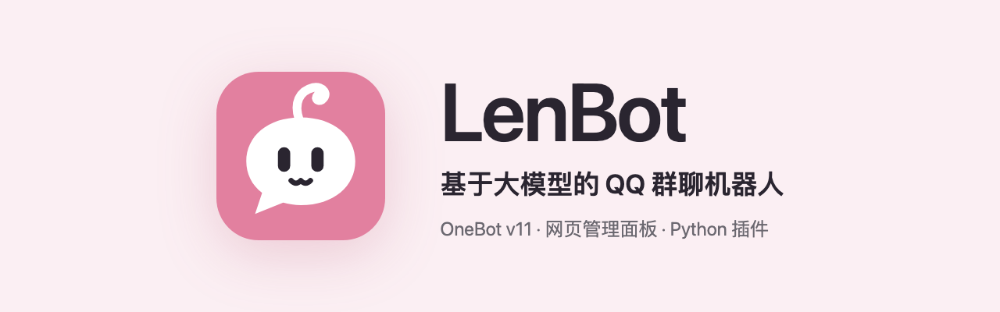

<p align="center"></p>

<p align="center"><a href="README.en.md">English</a> · <a href="https://lendevs.github.io/LenBot/">文档站</a> · <a href="https://lendevs.github.io/LenBot/guide/quick-start">快速开始</a></p>

LenBot 是一个基于大模型的 QQ 群聊机器人。它通过 OneBot v11 协议收发 QQ 消息，回复由模型生成。模型服务和 API Key 需要自己准备。

和 Bot 聊天不需要输入命令。群里有人发言时，由模型判断要不要接话。需要接话时，再决定回复哪一条消息，或者只回一个表情。有人请 Bot 写报告或查资料时，这项工作交给后台任务执行，不占用聊天，完成后结果会发回群里。


## 功能

- **群聊**　每个群各有一段连续的对话。对话变长以后，较早的内容会整理成一段摘要，面板里叫作「回想」。回复时可以引用原消息或 @ 对方，也可以只发一个表情。Bot 默认在被 @ 或被回复时说话，也可以设置为主动参与讨论。
- **角色**　人物设定和说话方式写在一个角色包里，包里还有底线、样例对话、资料和表情。默认角色是小然，安装后即可使用。修改角色时，可以先在面板里试聊，满意后再保存。
- **记忆**　记忆以 Markdown 文件的形式保存在本地，每个群分开存放。面板里可以查看和修改，也可以让 Bot 彻底忘掉某件事。
- **后台任务**　写报告和整理资料这类耗时的工作，在 Docker 容器里作为后台任务执行。执行期间可以继续追问或补充要求，也可以取消任务。
- **工具**　模型可以搜索和阅读网页，也能看图片和转写语音。合并转发的聊天记录和群成员名单同样可以读取。另外还可以接入 MCP 服务。
- **插件**　插件用 Python 编写，可以添加命令和定时任务，也可以给模型增加工具。官方插件有群聊总结、GSUID Core 桥接、A-SOUL 和哔哩哔哩四个。
- **群内用语**　LenBot 会记录群里常用的说法和表情，其中包括群里的黑话。记录下来的条目可以在面板里查看和修改，不需要的可以停用。
- **网页面板**　首次配置和之后的设置都在面板里完成。查看日志，以及升级和出错后的恢复，也都在面板里操作。主人也可以在群里直接让 Bot 修改设置。

## 使用前提和限制

- 目前只支持 QQ。
- LenBot 本身不登录 QQ，需要另外运行一个 OneBot 实现，例如 [NapCat](https://github.com/NapNeko/NapCatQQ)。
- 不附带模型。支持的接口有 OpenAI 兼容接口、OpenAI Responses、Anthropic 和 Gemini。
- 能理解语音消息，但只用文字回复。
- 提示词和面板只有中文。

## 快速开始

首个公开版本 0.2.0 尚未发布。在部署包和 Docker 镜像发布之前，请从源码运行。开始前需要准备：

- [uv](https://docs.astral.sh/uv/) 和 Node.js 22
- 一个已经登录 QQ 的 OneBot 实现
- 模型服务的接口地址和 API Key

```sh
git clone https://github.com/lendevs/LenBot.git
cd LenBot
./scripts/install.sh
uv run --no-sync len-bot
```

第一次启动时，终端会输出一个链接：

```text
尚无根配置。请打开 http://127.0.0.1:52811/#token=...
```

在浏览器中打开这个链接，按首次配置向导完成七个步骤，依次是「管理员账号」「连接 QQ」「主人」「选择模型」「向量模型」「角色和第一个群」「官方插件」。保存后 LenBot 会按新配置启动，页面自动跳转到面板。

向导中的「回复怎么发」第一次建议选择模拟发送。这时 Bot 的回复只显示在面板里，不会发到 QQ。先在面板的对话测试页试聊几轮，效果满意后，再到「设置 → 连接」把发送方式改为真实发送到 QQ。

详细步骤见文档站的[快速开始](https://lendevs.github.io/LenBot/guide/quick-start)。

## 安装方式

三种安装方式运行的是同一个程序。不确定选哪种时，推荐部署包。

| 方式 | 适用情况 |
|---|---|
| [部署包](https://lendevs.github.io/LenBot/guide/install-package) | 在自己的电脑或 Linux 服务器上长期运行。只依赖 uv，附带服务启停脚本，可以在面板中升级，升级失败时可以恢复 |
| [Docker](https://lendevs.github.io/LenBot/guide/install-docker) | 服务器和 NAS。在 Windows 上需要后台任务时也用这种方式 |
| [源码](https://lendevs.github.io/LenBot/guide/install-source) | 需要修改代码，或者想使用开发版 |

0.2.0 发布后，部署包会发布在 [GitHub Releases](https://github.com/lendevs/LenBot/releases)，Docker 镜像发布在 `ghcr.io/lendevs/lenbot`，Docker Hub 上也有同名镜像。

## 文档

| 内容 | 位置 |
|---|---|
| 安装、首次配置和日常使用 | [文档站](https://lendevs.github.io/LenBot/) |
| 部署方式和可选服务 | [部署](deploy/README.md) |
| 维护角色、插件和后台任务 | [使用与维护](deploy/current/operations.md) |
| 编写插件 | [插件开发](developer/README.md)，[插件模板](https://github.com/lendevs/lenbot-plugin-template) |
| 编写角色包 | [角色包](developer/personas.md)，[小然的角色包](examples/personas/companion/) |
| 内部结构 | [架构](developer/architecture.md) |
| 参与开发 | [开发指南](CONTRIBUTING.md) |

各版本说明的草稿在 [changelogs](changelogs/) 目录。

## 许可证

原创代码采用 [AGPL-3.0-only](LICENSE) 许可，详见 [NOTICE](NOTICE)。第三方依赖和独立服务沿用各自的许可，见 [THIRD_PARTY_NOTICES](THIRD_PARTY_NOTICES.md)。
